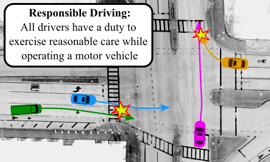

# Learning Responsibility Allocations

**Learning Responsibility Allocations for Safe Human-Robot Interaction
with Applications to Autonomous Driving**

Ryan K. Cosner, Yuxiao Chen, Karen Leung, and Marco Pavone



This code base trains responsibility allocation functions $\gamma$ as described in our paper. Closed-loop simulation is currently unavailable as it relies on other people's unpublished code. 

The pretrained model used to produce figures 2 and 3 and table 1 can be found [here](https://drive.google.com/file/d/1aTrjPtGGgnTG9B_31yVtDTjsdwIcH64c/view?usp=sharing). 

## Installation

Install `learning_responsibility_allocation`
```angular2html
conda create -n lra python=3.8
conda activate lra
git clone git@github.com:rkcosner/learning_responsibility_allocation.git
cd learning_responsibility_allocation
pip install -e .
```

Download [Static Scenes](https://drive.google.com/file/d/1YxoIXaBjAj7sc_thU2lfjkFy2fRyvnQu/view?usp=sharing) and unzip it in the ```learning_responsibility_allocation/tbsim/safety_funcs/``` folder.

Install `trajdata`
```
cd ..
git clone git@github.com:NVlabs/trajdata.gittrajdata
cd trajdata
# replace requirements.txt with trajdata_requirements.txt included in tbsim
pip install -e .
```

#### nuScenes
* Follow [this link](https://www.nuscenes.org/nuscenes) to the nuScenes dataset.
* Register an account with nuscenes.
* Download the US files for ```Full dataset (v1.0)>train_val``` 1 through 10 and the metadata, and the ```Map expansion``` pack v1.3 
* Organize the dataset directory as follows:
    ```
    nuscenes/
    │   maps/
    |   |   basemap/
    |   |   expansion/
    |   |   prediction/
    |   |   36092f0b03a857c6a3403e25b4b7aab3.png
    |   |   37819e65e09e5547b8a3ceaefba56bb2.png
    |   |   53992ee3023e5494b90c316c183be829.png
    |   |   93406b464a165eaba6d9de76ca09f5da.png
    |   samples/
    |   sweeps/
    │   v1.0-trainval/
    learing_responsibility_allocation/
    trajdata/
    ```
#### WandB
set up your weights and biases account using ```wandb login```
set your wandb api key ```export WANDB_APIKEY=<your api key>```
  
### 2. Train responsibility model
For standard training with WandB enter the following in ```learning_responsibility_allocation/```:
```
python3 scripts/train.py --dataset_path <path-to-nuscenes-data-directory> --config_name nusc_resp 
```
If you do not want logging to WandB, then enter the same command with the ```--debug``` flag: 
```
python3 scripts/train.py --dataset_path <path-to-nuscenes-data-directory> --config_name nusc_resp ---debug
```
